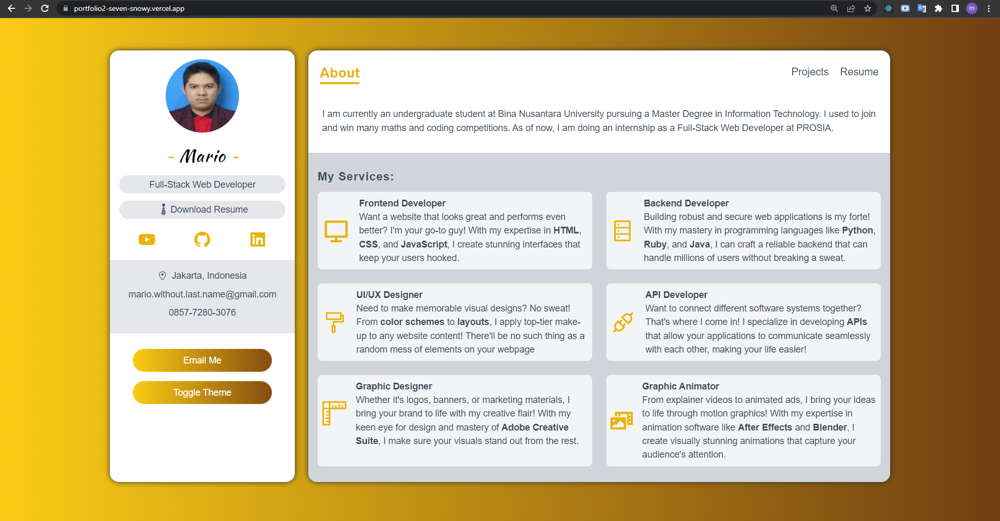
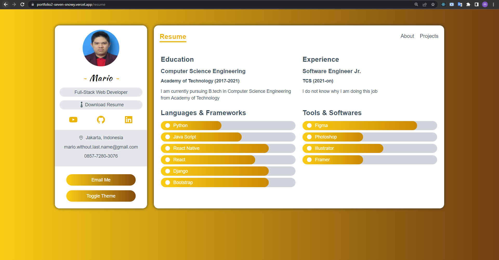
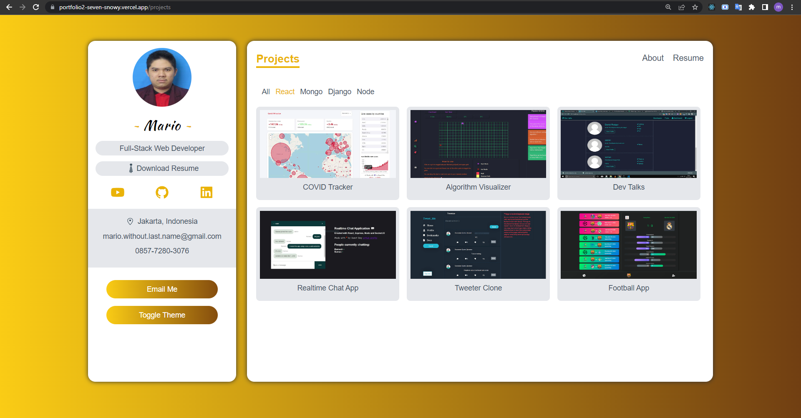
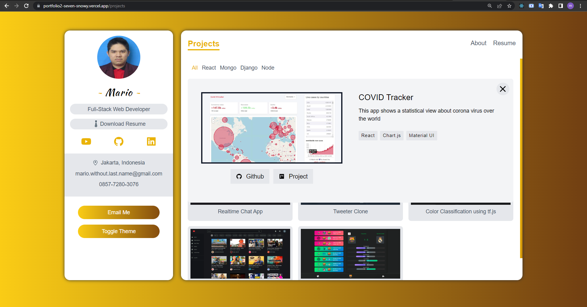
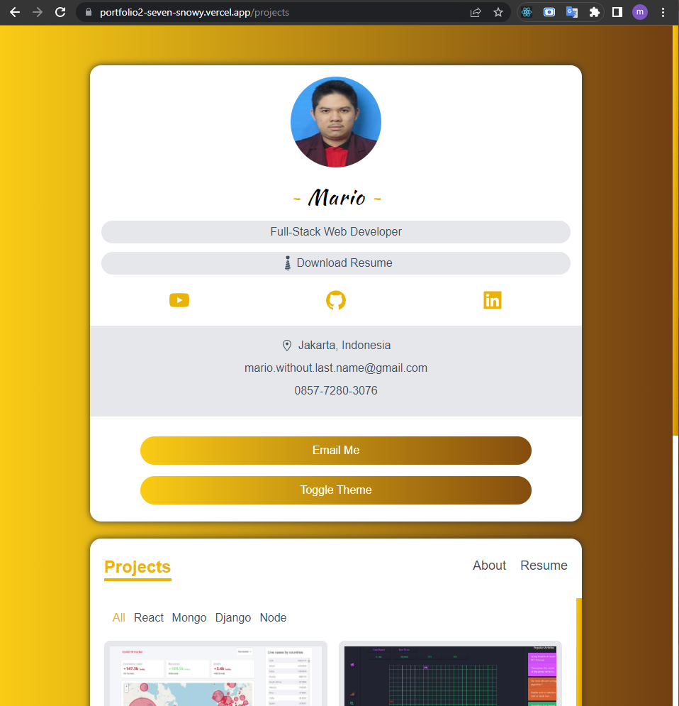

# Personal Portfolio (2nd)

---

A portfolio design that show cases my skills, resume, and projects (not actually filled with my real data yet)

Project made by Mario (with some of my own code modifications).

Project is hosted by Vercel. It can be viewed [here](https://portfolio2-seven-snowy.vercel.app/projects)

---

Some screenshots:

---

The tutorial video can be found [here](https://www.youtube.com/watch?v=atebfXxl9B4)

